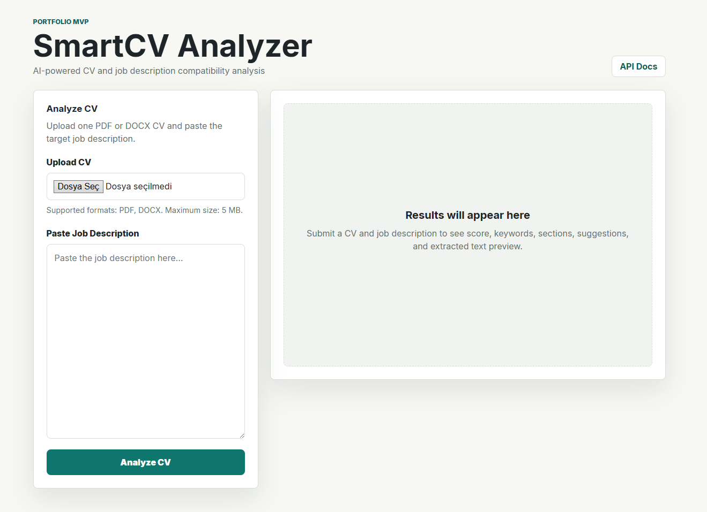
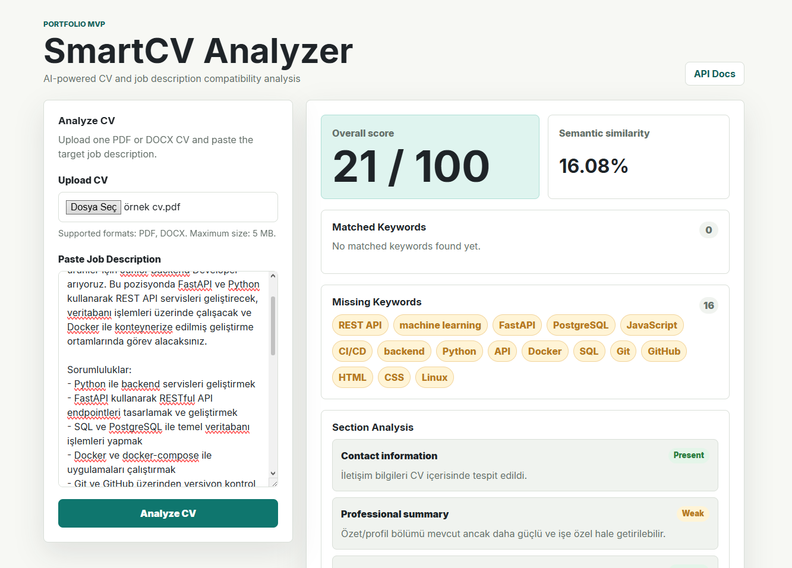

# SmartCV Analyzer

AI-powered CV and job description compatibility analysis system.

SmartCV Analyzer analyzes one uploaded PDF or DOCX CV against one manually pasted job description. The web UI, API, code, and documentation are written in English, while user-facing analysis feedback is returned in Turkish.

## Project Purpose

This is a portfolio MVP project designed to demonstrate practical software engineering across:

- FastAPI backend development
- NLP and rule-based text processing
- Embedding-based semantic similarity
- PDF and DOCX file processing
- REST API design
- Frontend integration with plain HTML, CSS, and JavaScript
- Docker containerization
- Automated tests
- Postman API testing

The MVP intentionally avoids authentication, databases, paid APIs, and job-posting scraping so the project stays understandable, local-first, and suitable for a developer portfolio.

## Features

- PDF and DOCX CV upload
- Manual job description input
- CV text extraction
- Keyword extraction and keyword matching
- Missing keyword detection
- Turkish and English CV section detection
- Embedding-based semantic similarity
- Overall compatibility score from `0` to `100`
- Turkish improvement suggestions
- Simple web interface
- FastAPI Swagger and ReDoc documentation
- Docker support
- Postman collection and environment
- Automated pytest suite

## Tech Stack

| Area | Technology |
| --- | --- |
| Backend | Python, FastAPI |
| NLP / Embeddings | `sentence-transformers`, `paraphrase-multilingual-MiniLM-L12-v2` |
| File Processing | PyMuPDF, python-docx |
| Frontend | HTML, CSS, JavaScript |
| Testing | pytest, httpx |
| Containerization | Docker, docker-compose |
| API Testing | Postman |

## Architecture Overview

```text
Browser
  |
  | Upload CV + paste job description
  v
FastAPI
  |
  |-- Validate file and form fields
  |-- Extract PDF/DOCX text
  |-- Clean and normalize text
  |-- Extract and match keywords
  |-- Detect CV sections
  |-- Calculate embeddings and semantic similarity
  |-- Calculate weighted compatibility score
  |-- Generate deterministic Turkish suggestions
  v
JSON response rendered by the frontend
```

The scoring pipeline combines semantic similarity, keyword match ratio, and section completeness.

## Screenshots

### Home Page



### Analysis Result



## Getting Started

### Prerequisites

- Python 3.11+
- Git
- Docker Desktop, optional

## Local Installation

```bash
git clone https://github.com/EmirhanB016/smartcv-analyzer.git
cd smartcv-analyzer
python -m venv .venv
```

Activate the virtual environment.

Windows PowerShell:

```powershell
.\.venv\Scripts\Activate.ps1
```

macOS/Linux:

```bash
source .venv/bin/activate
```

Install dependencies and run the app:

```bash
pip install -r requirements.txt
python -m uvicorn app.main:app --reload
```

Open:

```text
http://localhost:8000/
```

## Local Development

During development, run FastAPI with reload enabled:

```bash
python -m uvicorn app.main:app --reload
```

Useful local URLs:

- Frontend: `http://localhost:8000/`
- Health check: `http://localhost:8000/health`
- Swagger UI: `http://localhost:8000/docs`
- ReDoc: `http://localhost:8000/redoc`

Run tests before committing changes:

```bash
python -m pytest
```

## Docker Usage

Build the image:

```bash
docker compose build
```

Start the app:

```bash
docker compose up
```

Stop the app:

```bash
docker compose down
```

The app runs at:

```text
http://localhost:8000/
```

The Docker image defaults to port `8000` locally. On deployment platforms that provide a `PORT` environment variable, such as Render, the container binds Uvicorn to that provided port automatically.

For deployment, the Docker image installs CPU-only PyTorch from the official PyTorch CPU wheel index before installing `requirements.txt`. This avoids unnecessary CUDA and NVIDIA packages while keeping `sentence-transformers` available.

On low-resource deployment platforms, set `SMARTCV_EMBEDDINGS_ENABLED=false` to skip loading the heavy `sentence-transformers` model. The API will keep the same response schema and use a lightweight token-overlap semantic similarity fallback.

The first analysis may take longer because the embedding model can be downloaded or loaded on first use.

## Usage

1. Open `http://localhost:8000/`.
2. Upload a PDF or DOCX CV.
3. Paste a job description.
4. Click **Analyze CV**.
5. Review the overall score, semantic similarity, matched keywords, missing keywords, section analysis, Turkish suggestions, and extracted CV text preview.

## API Documentation

- Swagger UI: `http://localhost:8000/docs`
- ReDoc: `http://localhost:8000/redoc`

Main endpoint:

```http
POST /api/v1/analyze
```

Health endpoint:

```http
GET /health
```

## Example API Requests

Health check:

```bash
curl http://localhost:8000/health
```

Analyze CV:

```bash
curl -X POST "http://localhost:8000/api/v1/analyze" \
  -F "cv_file=@sample_cv.pdf" \
  -F "job_description=We are looking for a Python developer with FastAPI, Docker, SQL, REST API, and CI/CD experience."
```

Use a synthetic or personal-safe local file when testing the upload endpoint.

## Example API Response

```json
{
  "overall_score": 78,
  "semantic_similarity": 0.82,
  "matched_keywords": ["Python", "FastAPI", "Docker", "REST API"],
  "missing_keywords": ["CI/CD", "Kubernetes"],
  "section_analysis": [
    {
      "section": "Skills",
      "status": "present",
      "message": "Yetenekler bölümü CV içerisinde tespit edildi."
    },
    {
      "section": "Projects",
      "status": "weak",
      "message": "Projeler bölümü mevcut ancak kullanılan teknolojiler, sorumluluklar ve çıktılar daha net yazılabilir."
    }
  ],
  "suggestions": [
    "CV'niz iş ilanıyla genel olarak uyumlu görünüyor.",
    "Eğer bu alanlarda deneyiminiz varsa, CI/CD ve Kubernetes gibi anahtar kelimeleri CV'nizde daha görünür hale getirebilirsiniz."
  ],
  "extracted_cv_text_preview": "Software Developer with experience in Python, FastAPI, Docker and REST API development..."
}
```

## Testing

Run the automated test suite:

```bash
python -m pytest
```

The test suite covers:

- Text cleaning and normalization
- File validation
- File extraction
- Keyword extraction and matching
- Section detection
- Embedding and scoring helpers
- Feedback generation
- Analyze API endpoint success and validation errors

At the current MVP stage, the project includes 58 passing automated tests.

## Postman

Postman files:

- `postman/SmartCV_Analyzer.postman_collection.json`
- `postman/SmartCV_Analyzer.postman_environment.json`

Import both files into Postman, select the `SmartCV Analyzer Local` environment, and run the requests.

The environment provides:

```text
base_url = http://localhost:8000
```

See [docs/POSTMAN_TEST_PLAN.md](docs/POSTMAN_TEST_PLAN.md) for request details and manual verification steps.

## Project Structure

```text
app/
  api/
  core/
  schemas/
  services/
  utils/
frontend/
docs/
postman/
tests/
Dockerfile
docker-compose.yml
requirements.txt
README.md
LICENSE
```

## Documentation

- [docs/PRD.md](docs/PRD.md)
- [docs/TECHNICAL_ARCHITECTURE.md](docs/TECHNICAL_ARCHITECTURE.md)
- [docs/API_SPEC.md](docs/API_SPEC.md)
- [docs/SCORING_LOGIC.md](docs/SCORING_LOGIC.md)
- [docs/DEVELOPMENT_PLAN.md](docs/DEVELOPMENT_PLAN.md)
- [docs/POSTMAN_TEST_PLAN.md](docs/POSTMAN_TEST_PLAN.md)
- [docs/TASKS.md](docs/TASKS.md)

## Limitations

- OCR is not included; scanned or image-only PDFs may fail text extraction.
- No authentication.
- No database persistence.
- No job posting URL scraping.
- Analysis is deterministic and heuristic-based, not a replacement for professional career advice.
- The embedding model may take time to download or load on first run.

## Future Improvements

- OCR support for scanned PDFs
- User accounts and saved analyses
- Database persistence
- More advanced keyword extraction
- Better multilingual NLP support
- Export analysis as PDF
- Job posting URL parser
- CI/CD pipeline
- Deployment to a cloud platform

## Live Demo

The application is live at:

https://smartcv-analyzer.onrender.com

> Note: The live demo runs on a free Render instance, so the first request may be slower after inactivity.
On low-resource deployment environments, semantic similarity may run in fallback mode to avoid heavy model loading. Local Docker usage can still use the sentence-transformers model.

## Portfolio Highlights

SmartCV Analyzer is useful as a developer portfolio project because it demonstrates:

- End-to-end backend, frontend, and NLP workflow
- Real-world file upload and document analysis use case
- API-first design with FastAPI docs
- Dockerized local execution
- Automated tests
- Postman manual verification
- Clear milestone-based documentation

## License

This project is licensed under the MIT License. See [LICENSE](LICENSE).
